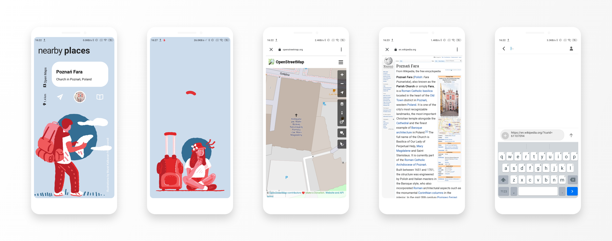

# 🗺️ Nearby Places
### Nearby places viewer app built with React Native, Wikipedia API, and Expo

A revamp of a [MediaWiki API demo app](https://github.com/wikimedia/mediawiki-api-demos/tree/master/apps/nearby-places-viewer). Find Wikipedia pages of places near you using [Expo's location module](https://docs.expo.io/versions/v38.0.0/sdk/location/) and [MediaWiki Action API's Geosearch module](https://www.mediawiki.org/wiki/API:Geosearch).

#### Installation
Get the APK from the [release section](https://github.com/tusindfryd/perfect-places/releases) to try it out on your Android device or install Expo by `npm install --global expo-cli`, clone the repository, and launch the project by `expo start`.

#### Screenshot

#### Credits
Illustrations by <a href="https://dribbble.com/muratkalkavan">Murat Kalkavan</a> from <a href="https://icons8.com/">Icons8</a>